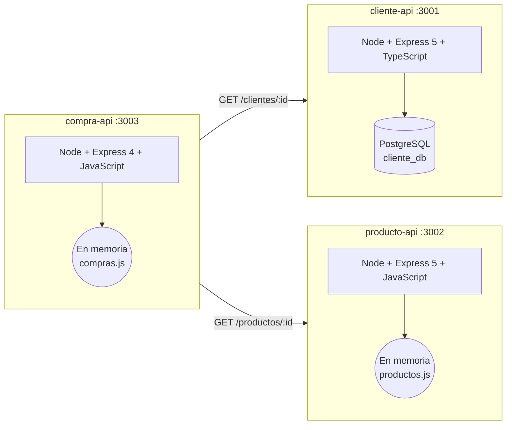

# Taller de Microservicios

[](https://nodejs.org)
[](https://expressjs.com)
[](https://www.postgresql.org)
[](https://www.typescriptlang.org)
[](https://pnpm.io)

Proyecto educativo (taller) de arquitectura de microservicios para una tienda online, construido con **Node.js + Express**. Cada servicio es una API independiente con su propio puerto, y uno de ellos se comunica con los demás vía HTTP.

> ⚠️ **Nota de estado:** este repositorio **no** está basado en Java/Spring Boot. Si ves referencias antiguas a `pom.xml`, H2 o puertos `8080` en la historia de git, ignorarlas: corresponden a una primera versión descartada del proyecto.

## Índice

- [Arquitectura](#arquitectura)
- [Servicios](#servicios)
- [Requisitos previos](#requisitos-previos)
- [Instalación y ejecución](#instalación-y-ejecución)
- [Configuración de PostgreSQL](#configuración-de-postgresql)
- [Variables de entorno](#variables-de-entorno)
- [Endpoints por servicio](#endpoints-por-servicio)
- [Ejemplos con curl](#ejemplos-con-curl)
- [Sobre la persistencia](#sobre-la-persistencia)
- [Roadmap / Pendientes](#roadmap--pendientes)

## Arquitectura



- **cliente-api** expone el CRUD de clientes y persiste en PostgreSQL (`cliente_db`) usando el driver `pg` con SQL crudo sin ORM.
- **producto-api** expone el catálogo de productos, actualmente en memoria.
- **compra-api** registra compras: antes de crear una, valida vía HTTP que el cliente y el producto existan y que haya stock suficiente.

## Servicios

| Servicio | Lenguaje | Framework | Persistencia | Puerto | Estado de la persistencia |
|----------|----------|-----------|--------------|--------|---------------------------|
| `cliente/` | TypeScript | Express 5 | PostgreSQL (`cliente_db`) | 3001 | **Persistente** (driver `pg`, sin ORM) |
| `producto/` | JavaScript (CommonJS) | Express 5 | In-memory (`src/data/productos.js`) | 3002 | En memoria |
| `compra-api/` | JavaScript (CommonJS) | Express 4 | In-memory (`src/data/compras.js`) | 3003 | En memoria |

## Requisitos previos

- **Node.js 18+**. No hay campo `engines` declarado en los `package.json`, pero Express 5 y `tsx` requieren Node 18 o superior, y `pg` requiere Node 16+. Usar una versión 18+ es lo seguro.
- **pnpm** para instalar dependencias (se usa `pnpm-lock.yaml` en `cliente/` y `compra-api/`; `producto/` también incluye un `package-lock.json`, por lo que funciona con `npm` si se prefiere).
- **PostgreSQL** en ejecución (obligatorio solo para `cliente`).

## Instalación y ejecución

Cada servicio debe instalarse y ejecutarse desde su propio directorio. Usa **tres terminales** (una por servicio).

### cliente (puerto 3001)

```bash
cd cliente
pnpm install
cp .env.example .env   # ajustar credenciales de PostgreSQL si hace falta
pnpm dev               # arranca con tsx en modo watch
```

Scripts disponibles (`cliente/package.json`): `build` (`tsc`), `typecheck` (`tsc --noEmit`), `start` (`node dist/server.js`), `dev` (`tsx watch src/server.ts`).

### producto (puerto 3002)

```bash
cd producto
pnpm install
pnpm dev               # nodemon
```

No requiere variables de entorno: el puerto por defecto es 3002 (aunque hay un `producto/.env.example` incompleto, ver abajo). Scripts disponibles (`producto/package.json`): `start` (`node src/server.js`), `dev` (`nodemon src/server.js`).

### compra-api (puerto 3003)

```bash
cd compra-api
pnpm install
cp .env.example .env   # mantener las URLs que apuntan a cliente-api y producto-api
pnpm dev               # nodemon
```

Scripts disponibles (`compra-api/package.json`): `start` (`node src/server.js`), `dev` (`nodemon src/server.js`).

**Orden recomendado:** primero `cliente` y `producto`, y luego `compra-api`, ya que este último consulta a los otros dos al crear compras.

## Configuración de PostgreSQL

Solo `cliente` necesita PostgreSQL. Los scripts SQL están en la carpeta [`database/`](database/README.md) y **deben ejecutarse con `psql`** (usan meta-comandos de psql como `\c`, `\set`, `\if` y `\gset`, por lo que no funcionan en clientes gráficos como pgAdmin o DBeaver).

```bash
cd database

# 1. Roles y bases de datos (cliente_db, producto_db, compra_db)
psql -U postgres -f 01-roles-y-bases.sql

# 2. Tablas de cliente (dentro de cliente_db)
psql -U postgres -f 02-tablas-cliente.sql

# 3. Tablas de producto (dentro de producto_db)
psql -U postgres -f 03-tablas-producto.sql

# 4. Tablas de compra (dentro de compra_db, incluye compra_detalle N:N)
psql -U postgres -f 04-tablas-compra.sql

# 5. Datos de prueba (5 clientes, 5 productos, 5 compras)
psql -U postgres -f 05-datos-prueba.sql
```

Los scripts 03 y 04 crean también las bases `producto_db` y `compra_db`, que hoy no consume ningún servicio (ver [Sobre la persistencia](#sobre-la-persistencia)) pero quedan preparadas para una futura migración.

## Variables de entorno

### cliente (`cliente/.env.example`)

| Variable       | Valor por defecto      | Descripción                      |
|----------------|------------------------|----------------------------------|
| `PORT`         | `3001`                 | Puerto del servicio              |
| `DB_HOST`      | `localhost`            | Host de PostgreSQL               |
| `DB_PORT`      | `5432`                 | Puerto de PostgreSQL             |
| `DB_NAME`      | `cliente_db`           | Base de datos de clientes        |
| `DB_USER`      | `cliente_user`         | Usuario de BD con privilegios mínimos |
| `DB_PASSWORD`  | `cliente_pass_123`     | Contraseña del usuario de BD     |

### producto (`producto/.env.example`)

El archivo solo contiene `PORT=` sin valor (incompleto). El servicio no lee ninguna variable de entorno: el puerto por defecto es `3002`.

### compra-api (`compra-api/.env.example`)

| Variable              | Valor por defecto      | Descripción                     |
|-----------------------|------------------------|---------------------------------|
| `PORT`                | `3003`                 | Puerto del servicio             |
| `CLIENTE_API_URL`     | `http://localhost:3001`| URL base de cliente-api         |
| `PRODUCTO_API_URL`    | `http://localhost:3002`| URL base de producto-api        |

## Endpoints por servicio

### cliente-api — `http://localhost:3001`

| Método | Path          | Body                                | Respuestas |
|--------|---------------|-------------------------------------|------------|
| GET    | `/clientes`   | —                                   | `200` lista de clientes, `500` |
| GET    | `/clientes/:id` | —                                 | `200` cliente, `404` no encontrado, `500` |
| POST   | `/clientes`   | `{ "nombre": string, "email": string }` | `201` cliente creado, `400` faltan campos, `409` email duplicado, `500` |

### producto-api — `http://localhost:3002`

| Método | Path          | Body                                          | Respuestas |
|--------|---------------|-----------------------------------------------|------------|
| GET    | `/productos`  | —                                             | `200` lista de productos |
| GET    | `/productos/:id` | —                                           | `200` producto, `404` no encontrado |
| POST   | `/productos`  | `{ "nombre": string, "precio": number, "stock": number }` | `201` producto creado, `400` faltan campos |

### compra-api — `http://localhost:3003`

| Método | Path        | Body                                             | Respuestas |
|--------|-------------|--------------------------------------------------|------------|
| GET    | `/compras`  | —                                                | `200` lista de compras |
| GET    | `/compras/:id` | —                                              | `200` compra, `404` no encontrada |
| POST   | `/compras`  | `{ "clienteId": number, "productoId": number, "cantidad": number }` | `201` compra creada, `400` faltan campos o stock insuficiente, `404` cliente/producto no existe, `503` servicio dependiente caído |

## Ejemplos con curl

```bash
# Listar y crear clientes (cliente-api :3001)
curl http://localhost:3001/clientes
curl -X POST http://localhost:3001/clientes \
  -H "Content-Type: application/json" \
  -d '{"nombre": "Juan Perez", "email": "juan@correo.com"}'

# Listar y crear productos (producto-api :3002)
curl http://localhost:3002/productos
curl -X POST http://localhost:3002/productos \
  -H "Content-Type: application/json" \
  -d '{"nombre": "Mouse Logitech", "precio": 25.0, "stock": 50}'

# Crear una compra: valida cliente en :3001 y producto/stock en :3002 (compra-api :3003)
curl -X POST http://localhost:3003/compras \
  -H "Content-Type: application/json" \
  -d '{"clienteId": 1, "productoId": 1, "cantidad": 2}'

# Consultar compras
curl http://localhost:3003/compras
```

> **Prueba del flujo completo:** `POST /compras` depende de que `cliente-api` y `producto-api` estén corriendo. Si no hay clientes o productos creados aún, crea primero un cliente (`:3001`) y un producto (`:3002`), y usa los `id` devueltos al crear la compra. Si los servicios están caídos, la respuesta será `503`.

## Sobre la persistencia

- **`cliente/` es el único microservicio migrado a PostgreSQL** y lo hace **sin ORM**: usa el driver `pg` con consultas SQL crudas y parametrizadas (`$1`, `$2`) definidas directamente en `src/routes/clientes.routes.ts`.
- La **ausencia de ORM es intencional** como requisito del taller: el objetivo es evidenciar los riesgos y costos del SQL hardcodeado en un proyecto real (mantenibilidad, falta de migraciones automáticas, posibilidad de inyección SQL si se eliminan los parámetros, acoplamiento al esquema concreto de la base). **No es una recomendación de buena práctica** para producción.
- **`producto/` y `compra-api/` todavía no tienen persistencia real:** mantienen sus datos en arreglos dentro de `src/data/` que se reinician al reiniciar el proceso. Aunque `producto/` declara `pg` en sus dependencias, no lo utiliza.

## Roadmap / Pendientes

- [ ] Migrar `producto/` de datos en memoria a una base de datos persistente (la infraestructura `producto_db` ya existe en `database/`).
- [ ] Migrar `compra-api/` a persistencia (`compra_db` ya está contemplada en `database/`, con la tabla de rompimiento `compra_detalle`).
- [ ] Completar `producto/.env.example` (solo contiene `PORT=`).
- [ ] Declarar el campo `engines` en los `package.json` para fijar la versión mínima de Node.

---

Proyecto con fines educativos (taller) sobre arquitectura de microservicios.